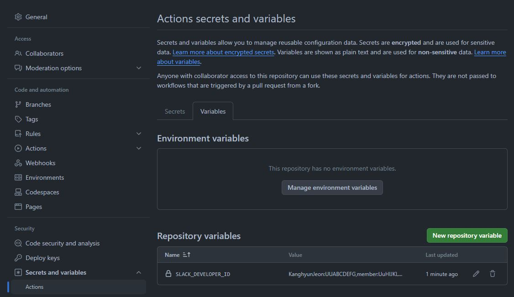

# github-slack-id-mapper-action
Input Github ID and Return Slack ID Action.

<br/>
<br/>

## Inputs

**`github-developer-id-mapping`** <br/>
String that we need for mapping from Github ID to Slack ID <br/>
**Required: true** <br/>
Ex) 'KanghyunJeon:UUABCDEFG,member:UuHIJKLMN' or recommended way like ${{ vars.SLACK_DEVELOPER_ID }}

**`github-user-id`** <br/>
Choice 1 / Single ID / String that we want to search from 'github-developer-id-mapping'.
**Required: false** <br/>
Ex) use something like ${{ github.event.pusher.name }} or Just any string value(in this case 'KanghyunJeon')

**`github-user-ids`** <br/>
Choice 2 / Multiple IDs / String that multiple reviewer's ids that we want to search from 'github-developer-id-mapping'. GitHub IDs to Slack IDs
**Required: false** <br/>
Ex) use something like ${{ join(github.event.pull_request.requested_reviewers.*.login, ',') }} or Just any string value(in this case 'KanghyunJeon,user1,user2')

<br/>
<br/>

## Outputs

**`slack-user-id`** <br/>
Slack User ID will be returned as mentioning type. <br/>
Ex) if there is `github-user-id` value in `github-developer-id-mapping` value, the matching Slack ID will be returned.
    Like `<@Slack User ID>`
    In this case, KanghyunJeon will return `<@UUABCDEFG>` <br/>
Ex) if not, 'github-user-id' will be returned.
    In this case, KanghyunJeon


<br/>
<br/>
<br/>

## How to use?
**Recommended Way for github-developer-id-mapping**

<br/>

```yaml
name: Github Slack ID Mapper Action

on:
  push:
    branches:
      - main #set whatever case you want to trigger this

jobs:
  pull-request-reviewer-reminder:
    runs-on: ubuntu-latest
    steps:
      - name: getSlackID
        id: firstStepId
        uses: KanghyunJeon/github-slack-id-mapper-action@v1.0.1
        with:
          github-developer-id-mapping: "KanghyunJeon:UUABCDEFG,member:UuHIJKLMN" # Required, need to set github repository vaiables 
          # ex) KanghyunJeon:UUABCDEFG,member:UuHIJKLMN' or something like ${{ vars.SLACK_DEVELOPER_ID }}
          github-user-id: KanghyunJeon # Required   ex) KanghyunJeon, ${{ github.event.pusher.name }}
      - name: doOtherJobs
        run: echo "SlackID = ${{ steps.firstStepId.outputs.slack-user-id }}" 
             # Do other works with that SlackID

``` 


<br/>
<br/>

## Author
**KanghyunJeon**